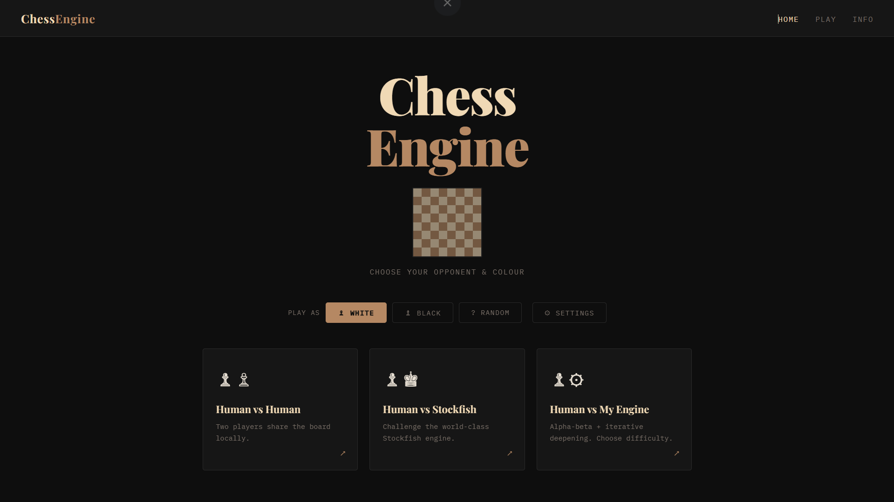
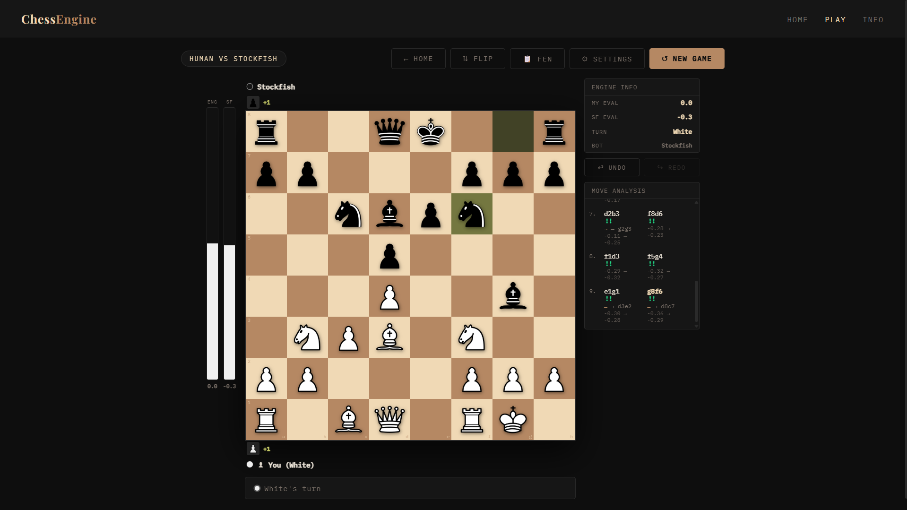
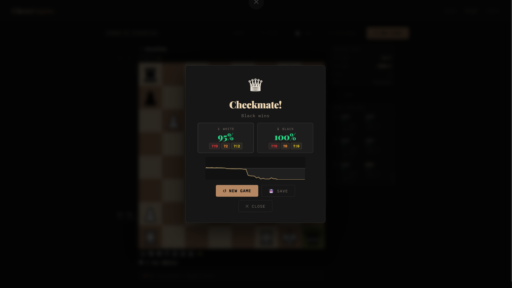
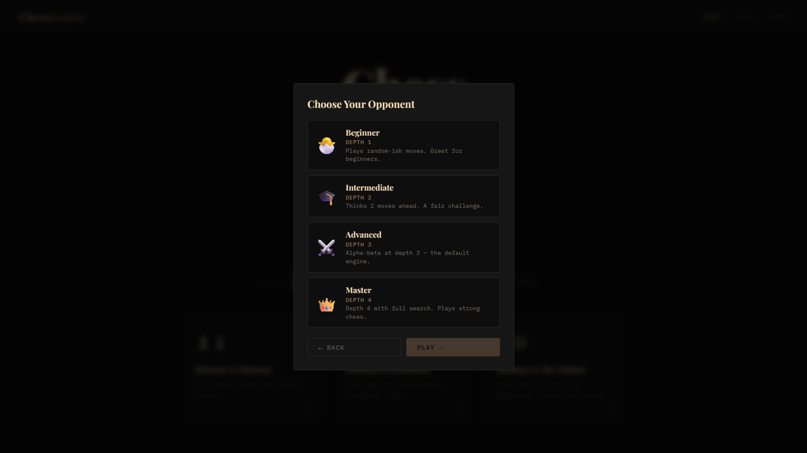
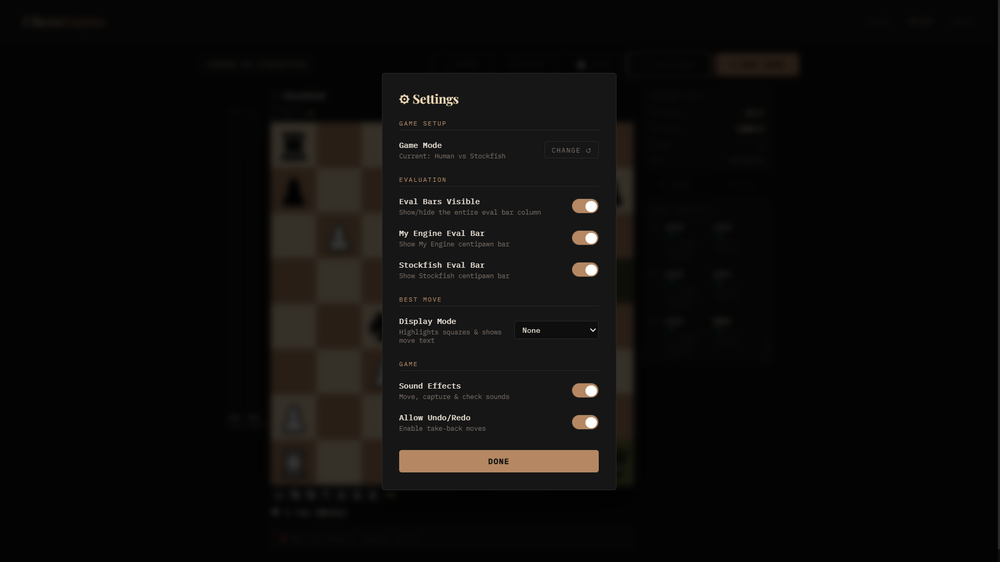
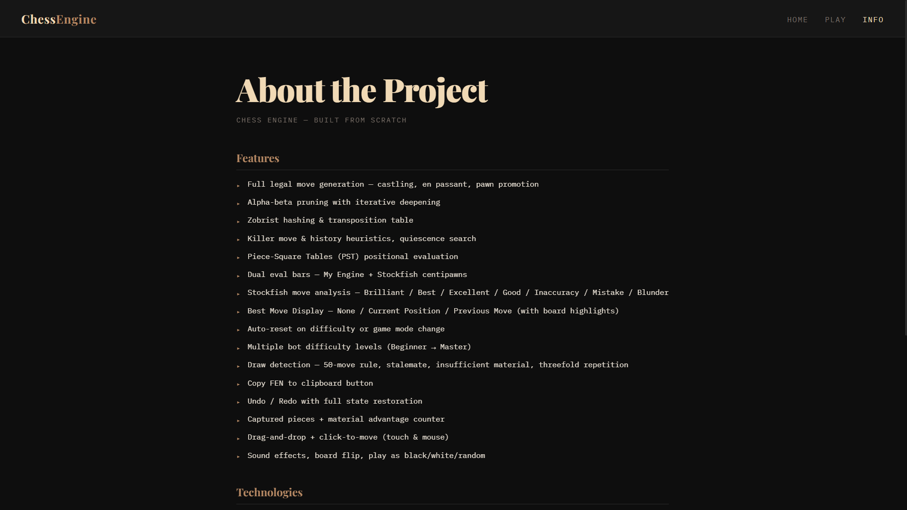
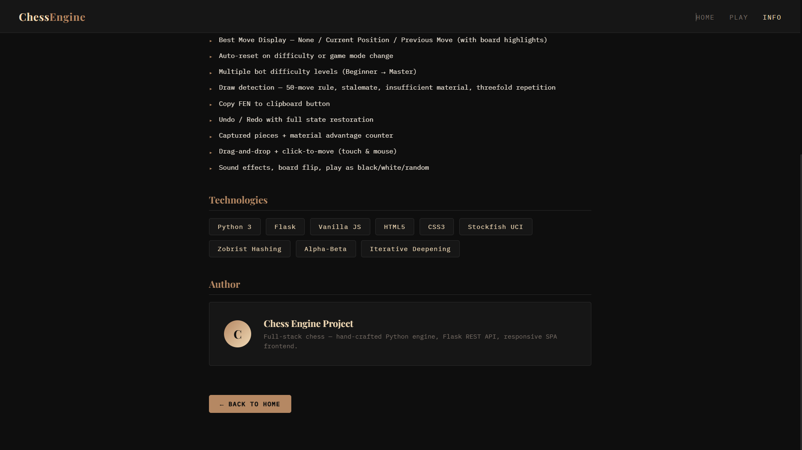

# ♟️ Chess Engine Web App with Stockfish Analysis

## 🔗 Live Demo

👉 https://your-app.onrender.com *(replace after deploy)*

A full-stack chess web application featuring a custom-built engine, Stockfish integration, and advanced move analysis — inspired by platforms like Chess.com and Lichess.

---

## ⭐ Highlights

* Built a custom chess engine using **minimax + alpha-beta pruning**
* Integrated **Stockfish** for evaluation and move validation
* Designed a **move classification system** (Brilliant → Blunder)
* Implemented **undo/redo using snapshot-based state management**
* Deployed using **Flask + Gunicorn on Render**

---

## 📸 Screenshots

### 🏠 Home Screen



### ♟️ Gameplay (Human vs Human)



### 🤖 Gameplay with Analysis (Stockfish)



### 🎯 Game Setup & Mode Selection



### ⚙️ Settings Panel



### 📖 Features Overview



### 🧠 Tech & Architecture Overview



---

## 🚀 Features

### 🎮 Game Modes

* Human vs Human
* Human vs Stockfish
* Human vs Custom Engine

---

### 📊 Analysis System

* Move classification:

  * Brilliant 💎
  * Best
  * Excellent
  * Good
  * Inaccuracy
  * Mistake
  * Blunder

* Best move suggestions:

  * Current position
  * Previous move

---

### 📈 Post-Game Insights

* Accuracy system:

  * Accuracy % for White & Black
  * Blunders, Mistakes, Inaccuracies

* Evaluation graph (Stockfish-based)

* Full move-by-move analysis

---

### 🔁 Game Features

* Undo / Redo with full state restoration
* Save game functionality
* Interactive board UI
* Drag-and-drop + click-to-move
* Sound effects

---

## 🧠 Tech Stack

* **Backend:** Python (Flask)
* **Frontend:** JavaScript (SPA)
* **Engine:** Custom chess engine
* **Analysis:** Stockfish

---

## 🏗️ Architecture

* Frontend (SPA) communicates with backend via REST APIs

* Backend handles:

  * Move validation
  * Game state management
  * Engine evaluation
  * Stockfish integration

* Move history stores:

  * eval_before / eval_after
  * best move
  * classification

* Snapshot-based system used for undo/redo

---

## ⚡ Performance Notes

* Iterative deepening with alpha-beta pruning
* Efficient state snapshots for fast undo/redo
* Move ordering using heuristics
* Minimal recomputation of board states

---

## 🛠️ Run Locally

```bash
pip install -r requirements.txt
python app.py
```

Open:

```
http://127.0.0.1:5000
```

---

## ⚠️ Stockfish Setup

Stockfish binary is **not included** in this repository.

### Linux / Render

1. Download from:
   https://stockfishchess.org/download/

2. Place it at:

```
stockfish/stockfish
```

3. Make executable:

```bash
chmod +x stockfish/stockfish
```

> The app runs without Stockfish, but Stockfish-specific features will be disabled.

---

## 🚀 Deploy on Render

### Steps

1. Push project to GitHub

2. Go to https://render.com → New Web Service

3. Configure:

| Setting       | Value                             |
| ------------- | --------------------------------- |
| Environment   | Python                            |
| Build Command | `pip install -r requirements.txt` |
| Start Command | `gunicorn app:app`                |

4. Deploy 🚀

---

## ⚠️ Render Storage Note

Render uses **ephemeral storage**, meaning:

* `saved_games.json` resets on every deploy
* Saved games are not persistent

### Options:

* Accept temporary storage (simplest)
* OR use Render Disk for persistence

---

## 📊 Google Analytics

Google Analytics is integrated in `index.html`.

### To enable:

1. Go to https://analytics.google.com
2. Get Measurement ID (`G-XXXXXXXXXX`)
3. Replace it in `index.html`

---

## 📁 Project Structure

```
chess-engine/
├── app.py
├── engine.py
├── requirements.txt
├── Procfile
├── saved_games.json
├── stockfish/
├── sounds/
├── static/
└── templates/
```

---

## 🧪 Debug Endpoint

After deployment:

```
/debug
```

Check:

```json
"stockfish_ok": true
```

---

## 📌 Future Improvements

* Multiplayer support
* Cloud save system
* WASM-based engine optimization
* Performance tuning

---

## 💡 Project Status

> Production-ready — deployed using Flask + Gunicorn on Render.

---

## 👤 Author

**Sujal Ushir**
